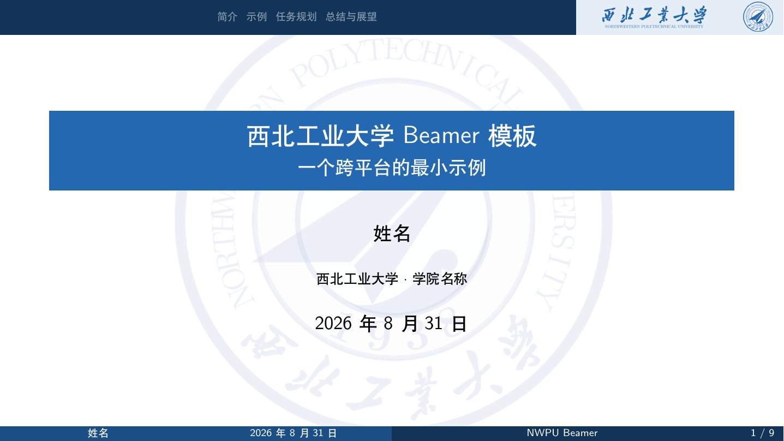
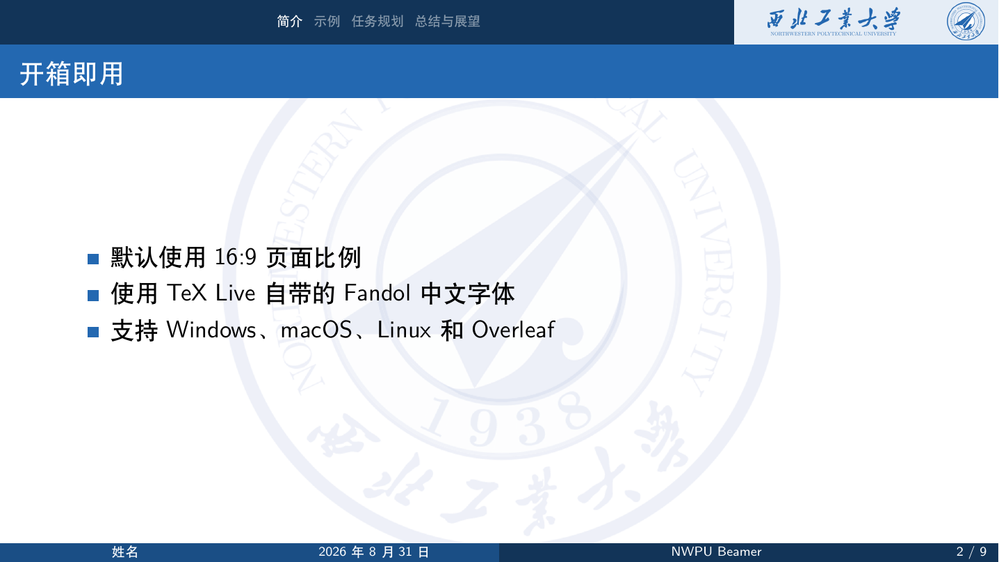
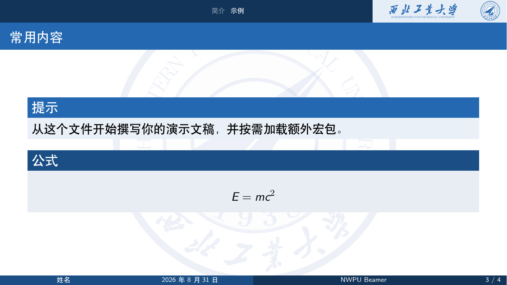

# NWPU-BEAMER

西北工业大学风格的 LaTeX Beamer 演示文稿模板。本项目基于早期清华大学、东南大学 Beamer 模板改造，提供中文/英文内容支持和一个可直接编译的最小示例。

> [!IMPORTANT]
> 本项目并非西北工业大学官方模板。仓库中的校名、校徽和视觉素材仅供模板演示；正式发布或对外使用前，请按学校现行视觉识别规范核对素材与组合方式。

## 特点

- 默认 16:9，也可切换为 4:3
- 使用 `ctexbeamer` 和 TeX Live 自带的 Fandol 字体
- 可在 Windows、macOS、Linux 和 Overleaf 上使用 XeLaTeX 编译
- GitHub Actions 使用 TeX Live 2026 自动编译 `main.tex`

## 快速开始

1. 克隆仓库：

   ```bash
   git clone https://github.com/ruiguoz/NWPU-BEAMER.git
   cd NWPU-BEAMER
   ```

2. 编辑 [`main.tex`](main.tex) 中的标题、作者、单位和日期。正文可以直接写在 `main.tex`，也可以继续在 `ppt01.tex`、`ppt02.tex` 中分章维护；它们由 `main.tex` 统一载入。

3. 使用 XeLaTeX 编译：

   ```bash
   latexmk -xelatex -interaction=nonstopmode -halt-on-error main.tex
   ```

   如果没有 `latexmk`，也可以运行两次：

   ```bash
   xelatex -interaction=nonstopmode -halt-on-error main.tex
   xelatex -interaction=nonstopmode -halt-on-error main.tex
   ```

编译产物为 `main.pdf`。首次使用前请安装包含中文支持的完整 TeX Live；Overleaf 中将 Compiler 设为 XeLaTeX。

不想安装 LaTeX 时，可以直接查看仓库中的 [`NWPU-BEAMER.pdf`](NWPU-BEAMER.pdf)。它由 CI 使用当前 `main.tex` 编译生成。

## 唯一主文件

[`main.tex`](main.tex) 是本项目**唯一需要编译的主文件**，也是使用者开始写演示文稿的入口。它负责：

1. 选择 `ctexbeamer`、16:9 页面和跨平台中文字体；
2. 加载 `nwpubeamer.sty` 主题；
3. 设置标题、作者、单位和日期；
4. 存放演示文稿内容，并统一载入正文分片 `ppt01.tex`、`ppt02.tex`。

其他主要文件的职责如下：

| 文件或目录 | 用途 | 是否直接编译 |
| --- | --- | --- |
| `main.tex` | 演示文稿入口和用户内容 | **是** |
| `ppt01.tex`、`ppt02.tex` | 正文分片，由 `main.tex` 通过 `\include` 载入 | 否 |
| `nwpubeamer.sty` | 主题实现：背景、颜色、页眉、页脚 | 否 |
| `source/` | 主题使用的校名、校徽和背景素材 | 否 |
| `docs/images/` | README 展示图片 | 否 |
| `.github/workflows/latex.yml` | 自动编译并检查 `main.tex` | 否 |

Windows 用户也可以运行 `genPPT.cmd`；该脚本同样只编译 `main.tex`。`clear.bat` 用于清理它产生的辅助文件。

## 字体

`main.tex` 默认使用：

```tex
\documentclass[aspectratio=169,fontset=fandol]{ctexbeamer}
```

Fandol 随 TeX Live 分发，不依赖 Windows 的 `SimSun`、`SimHei` 或 `KaiTi`。如果确实需要系统字体，可以把 `fontset=fandol` 改为 CTeX 支持的 `fontset=windows`、`fontset=mac` 或 `fontset=ubuntu`；跨平台共享文档时建议保留 Fandol。

## 页面比例

默认示例使用 16:9。若要生成 4:3 文稿，将 `main.tex` 首行改为：

```tex
\documentclass[aspectratio=43,fontset=fandol]{ctexbeamer}
```

背景图以保持比例的方式居中显示，不会随页面比例拉伸。

## 视觉素材

本次小更新没有把旧主题色直接替换成一个未经核对的 RGB 值。学校章程记录的标准色为 `C100 M70`，党委宣传部于 2020 年发布了[西北工业大学新 VI 及使用示例](https://news.nwpu.edu.cn/info/1210/74474.htm)和源文件。正式维护主题视觉时，应从官方 VI 源文件重新导出适合屏幕显示的 RGB 颜色及矢量 Logo，并核对校名字体和组合规范。

当前 `source/` 仍属于历史模板素材，不应视为官方最新 VI。

## 自动编译

每次 push 或 pull request 都会运行 `.github/workflows/latex.yml`，在 Linux + TeX Live 2026 中用 XeLaTeX 编译 `main.tex`，并上传 `NWPU-BEAMER.pdf` 作为 Actions artifact。

## 示例效果

以下图片由 GitHub Actions 在 Linux + TeX Live 2026 环境中实际编译 `main.tex` 后生成。







## 许可与素材

请阅读 [`LICENSE`](LICENSE)。模板代码、学校标识/VI、字体以及第三方来源内容的权利范围不同：MIT 许可不自动覆盖校名、校徽、字体或其他第三方素材。

## 致谢

本模板基于早期清华大学与东南大学 Beamer 模板改造。感谢原作者与使用者的贡献和反馈。
